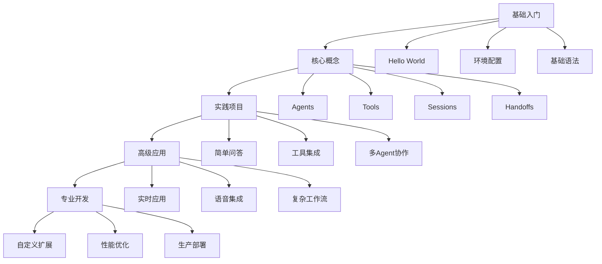

# OpenAI Agents SDK 学习路径指南

## 🎯 学习目标

本指南将帮助你从零开始掌握 OpenAI Agents SDK，从基础概念到高级应用，逐步构建你的 AI Agent 开发技能。

## 📚 学习路径概览



## 🚀 第一阶段：基础入门 (1-2周)

### 1.1 环境准备

**目标**: 搭建开发环境，理解基本概念

**任务清单**:
- [ ] 安装 Python 3.9+
- [ ] 创建虚拟环境
- [ ] 安装 OpenAI Agents SDK
- [ ] 配置 OpenAI API Key
- [ ] 运行第一个示例

**实践步骤**:
```bash
# 1. 创建项目目录
mkdir my-agents-project
cd my-agents-project

# 2. 创建虚拟环境
python -m venv .venv
source .venv/bin/activate  # Windows: .venv\Scripts\activate

# 3. 安装 SDK
pip install openai-agents

# 4. 设置 API Key
export OPENAI_API_KEY=sk-your-api-key-here
```

**学习资源**:
- 📖 [快速开始指南](quickstart.md)
- 🎯 示例: `examples/basic/hello_world.py`
- 📚 文档: [Agent 基础](agents.md)

### 1.2 Hello World 实践

**目标**: 理解 Agent 和 Runner 的基本用法

**实践代码**:
```python
import asyncio
from agents import Agent, Runner

async def main():
    agent = Agent(
        name="我的第一个助手",
        instructions="你是一个友好的助手，用中文回答问题。",
    )
    
    result = await Runner.run(agent, "请介绍一下你自己")
    print(result.final_output)

if __name__ == "__main__":
    asyncio.run(main())
```

**学习要点**:
- Agent 的基本结构
- Runner.run() 的使用
- 异步编程基础
- 结果处理

### 1.3 基础概念理解

**核心概念**:
1. **Agent**: 配置了指令、工具、护栏的 LLM
2. **Runner**: 执行 Agent 的运行器
3. **Instructions**: Agent 的行为指令
4. **Final Output**: Agent 的最终输出

**练习任务**:
- [ ] 创建不同角色的 Agent（客服、老师、助手）
- [ ] 尝试不同的 instructions
- [ ] 理解同步和异步运行的区别

## 🔧 第二阶段：核心概念 (2-3周)

### 2.1 工具集成 (Tools)

**目标**: 学习如何给 Agent 添加功能

**学习路径**:
1. 基础工具函数
2. 复杂工具集成
3. 工具链组合

**实践示例**:
```python
from agents import Agent, Runner, function_tool
from typing import Annotated

@function_tool
def get_weather(city: Annotated[str, "要查询天气的城市"]) -> str:
    """获取指定城市的天气信息"""
    # 这里可以集成真实的天气 API
    return f"{city}的天气是晴天，温度25°C"

agent = Agent(
    name="天气助手",
    instructions="你是一个天气查询助手，可以帮助用户查询天气信息。",
    tools=[get_weather],
)

# 使用工具
result = await Runner.run(agent, "北京今天天气怎么样？")
```

**学习资源**:
- 📖 [工具文档](tools.md)
- 🎯 示例: `examples/basic/tools.py`
- 🎯 示例: `examples/tools/` 目录

### 2.2 会话管理 (Sessions)

**目标**: 实现 Agent 的记忆功能

**核心概念**:
- Session: 会话管理
- 对话历史维护
- 上下文保持

**实践示例**:
```python
from agents import Agent, Runner, SQLiteSession

agent = Agent(
    name="记忆助手",
    instructions="你是一个有记忆的助手，会记住之前的对话。",
)

# 创建会话
session = SQLiteSession("user_123")

# 第一次对话
result1 = await Runner.run(
    agent, 
    "我的名字是张三", 
    session=session
)

# 第二次对话 - Agent 会记住之前的信息
result2 = await Runner.run(
    agent, 
    "我刚才告诉你我的名字是什么？", 
    session=session
)
```

**学习资源**:
- 📖 [会话文档](sessions.md)
- 🎯 示例: `examples/memory/` 目录

### 2.3 Agent 交接 (Handoffs)

**目标**: 实现多 Agent 协作

**核心概念**:
- Handoff: Agent 之间的控制权转移
- 路由决策
- 专业化 Agent

**实践示例**:
```python
# 创建专业化的 Agent
math_agent = Agent(
    name="数学助手",
    instructions="你专门处理数学问题，提供详细的解题步骤。",
)

english_agent = Agent(
    name="英语助手", 
    instructions="你专门处理英语学习问题，提供语法和词汇帮助。",
)

# 创建路由 Agent
router_agent = Agent(
    name="路由助手",
    instructions="根据用户问题类型，将问题转交给合适的专家。",
    handoffs=[math_agent, english_agent],
)
```

**学习资源**:
- 📖 [交接文档](handoffs.md)
- 🎯 示例: `examples/handoffs/` 目录

## 🏗️ 第三阶段：实践项目 (3-4周)

### 3.1 项目一：智能客服系统

**目标**: 构建一个完整的客服系统

**功能要求**:
- [ ] 多轮对话支持
- [ ] 问题分类和路由
- [ ] 知识库查询
- [ ] 用户满意度收集

**技术栈**:
- Agent 基础配置
- 工具集成（知识库查询）
- 会话管理
- 交接机制

**实现步骤**:
1. 设计 Agent 架构
2. 实现基础工具
3. 配置路由逻辑
4. 添加会话管理
5. 测试和优化

### 3.2 项目二：研究助手

**目标**: 构建一个能够进行深度研究的 Agent

**功能要求**:
- [ ] 网络搜索能力
- [ ] 文档分析
- [ ] 信息整合
- [ ] 报告生成

**技术栈**:
- 复杂工具链
- 多 Agent 协作
- 结构化输出
- 护栏机制

**学习资源**:
- 🎯 示例: `examples/research_bot/`
- 🎯 示例: `examples/financial_research_agent/`

### 3.3 项目三：实时应用

**目标**: 构建实时交互的 Agent 应用

**功能要求**:
- [ ] 实时响应
- [ ] 流式输出
- [ ] 用户交互
- [ ] 状态管理

**技术栈**:
- 实时 API
- 流式处理
- WebSocket 集成
- 状态管理

**学习资源**:
- 🎯 示例: `examples/realtime/`
- 📖 [实时文档](realtime/guide.md)

## 🎓 第四阶段：高级应用 (4-6周)

### 4.1 语音集成

**目标**: 构建语音交互的 Agent

**学习内容**:
- 语音识别集成
- 语音合成
- 实时语音处理
- 多模态交互

**学习资源**:
- 🎯 示例: `examples/voice/`
- 📖 [语音文档](voice/pipeline.md)

### 4.2 复杂工作流

**目标**: 设计复杂的多 Agent 工作流

**学习内容**:
- 工作流设计模式
- 并行处理
- 错误处理
- 性能优化

**学习资源**:
- 🎯 示例: `examples/agent_patterns/`
- 📖 [多 Agent 文档](multi_agent.md)

### 4.3 护栏和安全

**目标**: 实现安全和可控的 Agent 系统

**学习内容**:
- 输入验证
- 输出过滤
- 安全护栏
- 风险评估

**学习资源**:
- 📖 [护栏文档](guardrails.md)
- 🎯 示例: `examples/agent_patterns/input_guardrails.py`

## 🚀 第五阶段：专业开发 (6-8周)

### 5.1 自定义扩展

**目标**: 开发自定义的 Agent 扩展

**学习内容**:
- 自定义工具开发
- 模型集成
- 扩展架构
- 插件系统

**学习资源**:
- 🎯 示例: `examples/model_providers/`
- 📖 [模型文档](models/index.md)

### 5.2 性能优化

**目标**: 优化 Agent 系统性能

**学习内容**:
- 并发处理
- 缓存策略
- 资源管理
- 监控和调试

**学习资源**:
- 📖 [追踪文档](tracing.md)
- 📖 [可视化文档](visualization.md)

### 5.3 生产部署

**目标**: 将 Agent 系统部署到生产环境

**学习内容**:
- 容器化部署
- 负载均衡
- 监控告警
- 故障恢复

## 📋 学习检查清单

### 基础阶段 ✅
- [ ] 能够创建基本的 Agent
- [ ] 理解 Agent 和 Runner 的关系
- [ ] 掌握异步编程基础
- [ ] 能够运行简单示例

### 核心概念阶段 ✅
- [ ] 能够创建和使用工具
- [ ] 实现会话管理
- [ ] 理解 Agent 交接机制
- [ ] 掌握结构化输出

### 实践项目阶段 ✅
- [ ] 完成至少一个完整项目
- [ ] 实现多 Agent 协作
- [ ] 掌握错误处理
- [ ] 能够调试和优化

### 高级应用阶段 ✅
- [ ] 实现复杂工作流
- [ ] 掌握护栏机制
- [ ] 能够处理实时交互
- [ ] 理解性能优化

### 专业开发阶段 ✅
- [ ] 能够开发自定义扩展
- [ ] 掌握生产部署
- [ ] 能够进行系统设计
- [ ] 具备故障排查能力

## 🎯 推荐学习资源

### 官方资源
- 📚 [官方文档](https://openai.github.io/openai-agents-python/)
- 🎯 [示例代码](examples/)
- 📖 [API 参考](ref/)

### 社区资源
- 💬 [GitHub 讨论](https://github.com/openai/openai-agents-python/discussions)
- 🐛 [问题报告](https://github.com/openai/openai-agents-python/issues)
- 📝 [博客文章](https://openai.com/blog)

### 实践项目
- 🏗️ [项目模板](examples/)
- 🎨 [设计模式](examples/agent_patterns/)
- 🔧 [工具集合](examples/tools/)

## 🚀 下一步行动

1. **立即开始**: 从 Hello World 示例开始
2. **设置环境**: 按照环境准备步骤操作
3. **选择项目**: 根据你的兴趣选择实践项目
4. **持续学习**: 按照学习路径逐步深入
5. **社区参与**: 加入社区讨论和贡献

## 💡 学习建议

### 学习方法
- **实践为主**: 多写代码，少看理论
- **循序渐进**: 不要跳跃式学习
- **项目驱动**: 通过项目学习新概念
- **社区交流**: 积极参与社区讨论

### 常见问题
- **Q: 如何选择合适的模型？**
  - A: 从 GPT-4 开始，根据需求调整
  
- **Q: 如何处理 API 限制？**
  - A: 实现重试机制和错误处理
  
- **Q: 如何优化性能？**
  - A: 使用缓存、并行处理和模型选择

### 学习时间安排
- **每日**: 1-2 小时实践
- **每周**: 完成一个学习阶段
- **每月**: 完成一个完整项目
- **持续**: 关注社区更新和最佳实践

---

**开始你的 AI Agent 开发之旅吧！** 🚀

记住：学习是一个持续的过程，不要害怕犯错，每个错误都是学习的机会。保持好奇心，勇于尝试新功能，你很快就能成为 AI Agent 开发专家！
